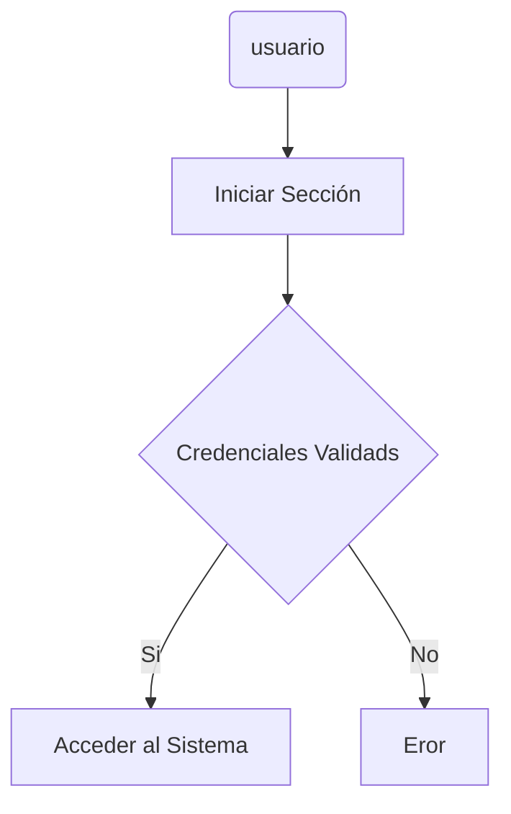
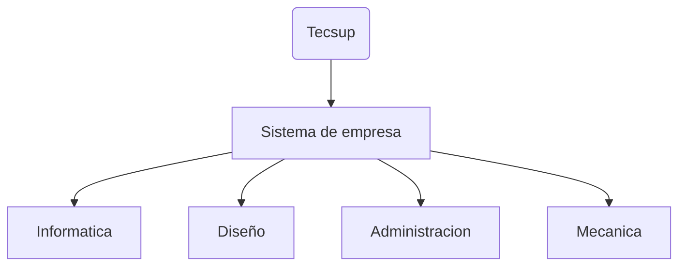

# Titulo importante
Me encuentro aprendiendo *Markdown* en las clases dek profesor Luis Pallin ...
## Subtitulo 01
Aqui verificanos como formatear diferentes **Tipos de textos***.
## Subtitulo 02
Podemos reconocer diferentes formatos textos usando ~~Markdown~~.

### Creando Hipervinculos
[Google](https://www.google.com)
[Tecsup](https://www.tecsup.com)

## Colocar imagenes


## Funciones

- [X] Registrar alumno
- [X] Generar matricula 
- [ ] Campo vacio 
- [ ] Libre 

## Creando tablas
| Lenguaje de programción | Creador |
| ------------------------|---------|
| Java |James Gosling |
| PHP  |Rasmus Lerdorf |
| Python |Guido van Rossum|
## Codigo
```css
body{
    background:"red";
}
```
```java
public class HolaMundo {
    public static void main(String[] args) {
        System.out.println("Hola mundo Java");
    }
}
```
```javascript
let nombre = "Pablo";
```
```Python
print ("Hola mundo")
```
## Mermaid Diagramas


## Mermaid 
